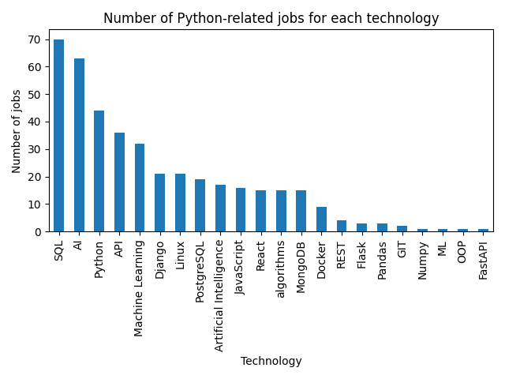

# djinni-vacancies-project

## Description
This project is a web scraper that collects data about Python-related job vacancies from Djinni.co. The data is then analyzed and visualized.

## Installation
1. Clone the repository: `git clone https://github.com/olgierrd/djinni-vacancies-project.git`
2. Navigate to the project directory: `cd djinni-vacancies-project`
3. Install the required dependencies: `pip install -r requirements.txt`

## Usage
1. Look over the tech list in config.py and add or remove technologies as needed.
2. Run the parser: `python parse.py` (the data will be saved to `jobs.csv`)
!!! Note: The parser is obligatory to run before the chart.ipynb, unless you have the jobs.csv file already.
3. Analyze and visualize the data: `jupyter notebook chart.ipynb`

## Saving the data
The graphs are saved in the png format for future using and comparison.
# Example of the chart:
